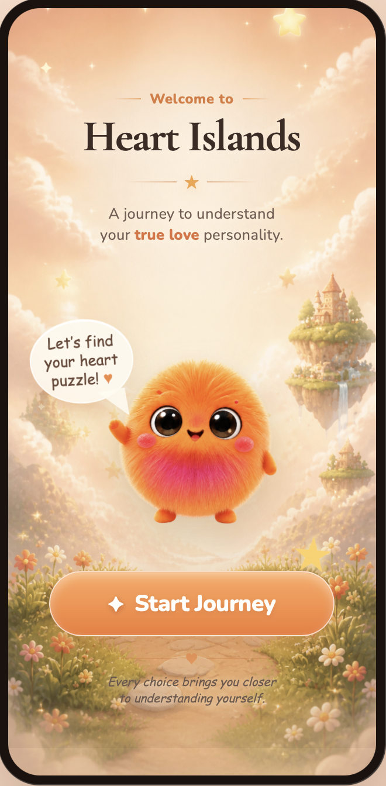
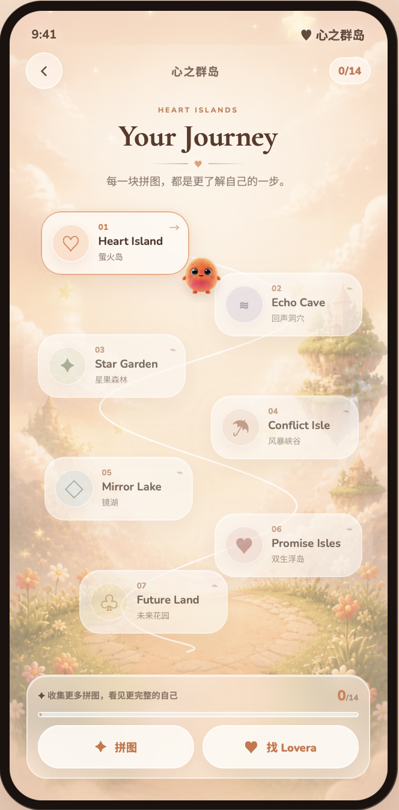

<div align="center">

# Heart Islands · 心之群岛

### 一次关于“我会怎样爱，也希望怎样被爱”的互动探索

与星灵旅伴 **Lovera** 一起穿越七座心之群岛，<br />
让十四次带着情境与情绪的选择，慢慢拼出属于你的关系画像。

[立即体验 Heart Islands](https://heart-islands-lovera.tutanglien5.chatgpt.site)

</div>

<table>
  <tr>
    <td width="50%" align="center">
      
      <br />欢迎页 · 进入心之群岛
    </td>
    <td width="50%" align="center">
      
      <br />旅程地图 · 找到一条关系旅程
    </td>
  </tr>
</table>

## 1. 产品目标用户

Heart Islands 面向 **18–30 岁、正在探索亲密关系的年轻人**。

他们可能刚刚对一个人心动，正处于暧昧期或恋爱初期；也可能经历过一段关系，开始重新思考：

- 我在关系里真正需要什么？
- 什么会让我靠近，又是什么会让我退后？
- 我需要怎样的距离，才会觉得舒服？
- 当对方和我不一样时，我会怎样回应？

他们熟悉 MBTI、恋爱测试和人格标签，却不满足于一个简单结论。他们不喜欢被严肃地“测量”，但愿意进入一个有角色、有情绪、有选择的故事；他们希望结果不仅能说中自己，还能被记住、被分享，并成为与朋友或伴侣继续交流的起点。

## 2. 用户痛点

很多关系测试最终只留下一个标签：某种依恋类型、消费类型，或一句看似准确却很难与真实生活连接的结论。

但关系里真正重要的，往往不是“你属于哪一类”，而是：**当有人靠近你、需要你，或与你意见不同时，你会怎样回应？**

传统测试通常存在三个问题：

1. **抽象提问缺少代入感**：直接问“你重视陪伴吗”，很难唤起真实的关系经验。
2. **理想化作答偏差**：用户容易选择“我希望成为的样子”，而不是情境中真正可能做出的反应。
3. **结果止于标签**：结论缺少形成过程、关系语境和后续行动，很难帮助用户继续理解自己。

## 3. 产品方案

Heart Islands 把抽象的关系问题放进一段可以真正走进去的互动故事。

用户与 Lovera 一起穿越心之群岛，在一个个微小却接近真实生活的瞬间里做选择：有人记住了你的习惯；你们需要一起走过一座窄桥；共同资源只够完成一件事；对方作出了与你不同的决定。

产品不急着判断用户，而是将一路上的选择逐步拼成：

- 一份有画面感、有证据线索的 **关系画像**；
- 一首由 Lovera 写给用户的 **专属诗篇**；
- 一本可以继续阅读、分享和讨论的 **个人恋爱说明书**；
- 一个旅程结束后仍能继续交流的 **Lovera 陪伴对话入口**。

### 十个关系探索方向

| 探索方向 | 我们关注的问题 |
| --- | --- |
| 心动开关 | 什么会让你愿意靠近？ |
| 亲密距离 | 你希望靠近，还是保留空间？ |
| 安全感来源 | 什么让你相信对方还在？ |
| 冲突模式 | 分歧出现时，你如何继续相处？ |
| 付出方式 | 你习惯用什么方式表达在乎？ |
| 金钱观 | 共同资源应该如何分配？ |
| 承诺观 | 什么样的确定性让你安心？ |
| 隐藏需求 | 什么是你不容易直接说出的需要？ |
| 关系雷区 | 什么会让你迅速关上心门？ |
| 理想伴侣特质 | 什么样的相处气质适合长期同行？ |

## 4. 产品体验

### 先进入故事，再开始了解自己

用户打开的不是一张问卷，而是一张等待探索的心之群岛地图。岛屿、场景、配音、动画和 Lovera 共同建立一个轻盈的入口，让“了解自己”变成一段有陪伴感的旅程。

### Lovera 先成为同行者

Lovera 不是冷冰冰的出题人。它会与你站在同一个故事空间里，一起前进、一起面对选择，并对你的决定作出回应。旅程结束后，它也会继续陪用户讨论关系、选择和那些不容易说出口的小困扰。

### 把抽象问题放回具体瞬间

- 在萤火草地，用户感受“被记住、被行动回应，还是被安静陪伴”中，哪一种更让自己心动。
- 走过云朵桥时，用户选择一起走、保持一点距离，或各自前进后再会合。
- 在星果森林，共同的星砂只能完成一件事，用户需要处理“我想要”和“我们需要”之间的协商。
- 当 Lovera 作出不同选择，问题从“我怎么想”推进到“我们还能不能把事情继续下去”。

<table>
  <tr>
    <td width="33%"></td>
    <td width="33%"></td>
    <td width="33%"></td>
  </tr>
  <tr>
    <td align="center">萤火草地 · 心动</td>
    <td align="center">风暴峡谷 · 冲突</td>
    <td align="center">双生浮岛 · 承诺</td>
  </tr>
</table>

### 最后留下的，不只是一个结果

完成十四次选择后，Lovera 会先整理一路上的选择，再让关系画像、诗篇和恋爱说明书逐渐显现。用户看到的不是突然公布的标签，而是一组可以继续讨论的线索：

- 我在关系里看重什么？
- 我通常怎样靠近别人？
- 我希望别人怎样理解我？
- 下一次遇到相似的关系时刻，我是否能更清楚地表达自己？

> [进入公开体验](https://heart-islands-lovera.tutanglien5.chatgpt.site) · 支持手机与桌面浏览器

## 5. 产品哲学

Heart Islands 借鉴三类设计思路：

- **情境判断**：用“此刻你会怎么做”替代抽象的自我评价。
- **叙事沉浸**：先让用户进入一个有角色、有情绪的故事，再作出选择。
- **情境化记录**：让每个答案保留关系上下文，而不是脱离场景评价用户。

我们相信，关系探索不应该是一场审判，也不应该把复杂的人压缩成一个标签。产品不替用户下定论，而是提供一个更具体、更温柔、更容易继续聊下去的自我观察入口。

因此，Heart Islands 是一款具有心理学设计依据的 **关系自我探索产品**，而不是临床诊断工具，也不宣称替代经过完整信效度验证的专业量表或心理服务。

## 6. 我们想给用户留下的

我们不只想让用户记住“我是某一种人”。

我们更希望留下：

- 一次被认真听见、被温柔陪伴的感受；
- 一套能够描述自己需要、边界和期待的关系语言；
- 一份可以持续补全、也可以与重要的人分享的关系档案；
- 一个在未来真实关系中，愿意更诚实表达、也更耐心理解彼此的起点。

当旅程结束，用户也许仍然没有所有答案。但他们会更接近一句属于自己的表达：

> **我开始知道自己会怎样爱，也更知道希望怎样被爱。**

---

## 本地运行

```bash
npm install
cp .env.example .env.local
npm run dev
```

在 `.env.local` 中填写服务端 `DEEPSEEK_API_KEY`。密钥不会进入前端构建，也不应提交到 GitHub。

## 生产构建

```bash
npm run build
```

项目包含七章互动故事、十四道关系探索题、Lovera 对话、关系测算、背景图片、配音、音乐与章节转场视频，并已适配手机端操作。
